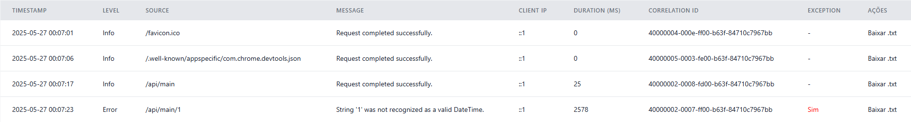

[](https://opensource.org/licenses/MIT)

# DevTrace

**DevTrace** é uma biblioteca para monitoramento de requisições em aplicações .NET.  
Ela registra as rotas acessadas, tempos de execução, códigos de status, exceções — exibindo tudo isso em um dashboard com diversos indicadores úteis.

---

## 📦 Instalação

Instale o pacote via NuGet (O pacote não foi criado ainda!):

```bash
dotnet add package DevTrace
```

---

## ⚙️ Configuração

No seu `Program.cs` ou `Startup.cs`, adicione o serviço e a UI:

```csharp
var builder = WebApplication.CreateBuilder(args);

// Adiciona os serviços
builder.Services.AddDevTrace();

var app = builder.Build();

// Habilita o rastreamento
app.UseDevTrace();

app.Run();
```

---

## 🧠 O que o DevTrace faz?

- ✅ Registra todas as requisições recebidas e enviadas
- ✅ Captura tempo de resposta e status HTTP
- ✅ Exportação de logs via .txt
- ✅ Exibe um dashboard acessível via `/devtrace` por padrão.
- ✅ Interface amigável e de fácil análise


---

## 📍 Acesse o painel

Após iniciar sua aplicação, vá para:

```
https://localhost:{porta}/devtrace
```

---

## 📊 Em breve

- [ ] Filtros por status, métodos e endpoints
- [ ] Adição de mais indicadores
- [ ] Atualização em tempo real 
- [x] Exportação de logs
- [ ] Armazenamento em banco
- [ ] Integração com algum modelo de IA para monitorar falhas

---

## 📃 Licença

MIT ©

---

## 🧪 Requisitos

- .NET 8 ou superior
- Estudando a disponibilização para para versões mais antigas.